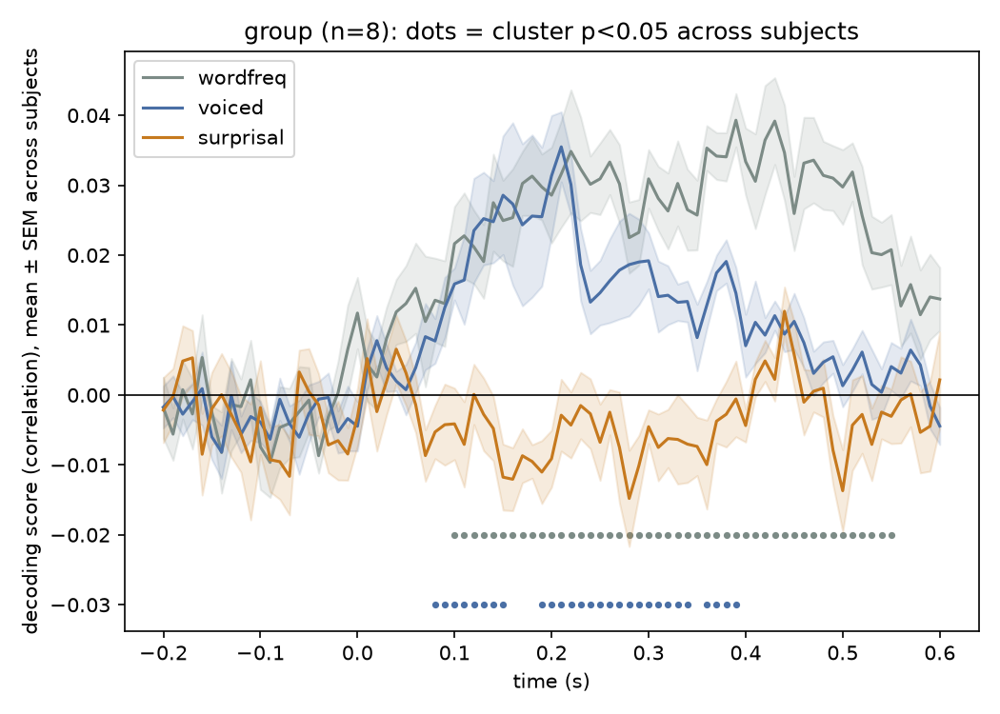

# Decoding Surprisal

Extends [`kingjr/meg-masc`](https://github.com/kingjr/meg-masc) — the MEG-MASC
dataset and decoding code released by Gwilliams, King, et al. — with one new
predictor and the significance testing the released script doesn't do.

Their `check_decoding.py` asks whether MEG activity, time-locked to word and
phoneme onsets, encodes **word frequency** and **phoneme voicing**. This adds
a third question, motivated by their own later paper on predictive coding in
speech comprehension ([Caucheteux, Gramfort & King, 2023, *Nat. Hum.
Behav.*](https://www.nature.com/articles/s41562-022-01516-2)): does it also
encode **word surprisal** — how unpredictable a word is given what came
before, estimated with GPT-2?

## What's original code vs. new

| File | What it is |
|---|---|
| `masc_lib.py` | `segment`, `correlate`, `decod`, `plot` — adapted from their `check_decoding.py` (BSD-3-Clause). `build_metadata` factors out their annotation-parsing so it's reusable; `decod_per_fold` is new. |
| `baseline_decoding.py` | Their two original analyses (word frequency, phoneme voicing), unmodified in substance. |
| `surprisal.py` | New: computes GPT-2 word surprisal from the story transcripts already in the BIDS metadata. |
| `extended_decoding.py` | New: wires surprisal in as a third contrast, then runs a within-subject cluster-based permutation test (folds as observations) — a fast single-subject sanity check. |
| `group_decoding.py` | New: the statistically correct version — `decod_subject` (also new, in `masc_lib.py`) gives one decoding curve per subject, then the cluster test runs across subjects, not folds. |

## Data

All 8 subjects (`03, 04, 05, 06, 08, 09, 10, 11`) available in this OSF
component of [MEG-MASC](https://github.com/kingjr/meg-masc) (project
`ag3kj`) — the full public release has 27 subjects across two OSF
components (~150GB); this is the first, laptop-sized (~29GB) one.

```
python -m venv .venv && source .venv/bin/activate
pip install -r requirements.txt
python scripts/download_data.py --subject 04 --out data/bids_anonym  # repeat per subject
```

## Run

```
python baseline_decoding.py --subject 04 --sessions 0,1
python surprisal.py --subject 04 --out results/surprisal_sub-04.csv
python extended_decoding.py --subject 04 --sessions 0,1 --surprisal results/surprisal_sub-04.csv
python group_decoding.py --subjects 03,04,05,06,08,09,10,11 --surprisal results/surprisal_sub-04.csv
```

`baseline_decoding.py`/`extended_decoding.py` run one subject at a time
(useful for a quick smoke test). `group_decoding.py` is the main result
— the group-level test across all 8 subjects, below.

## Results (group, n=8 subjects — all available in this OSF release)



| contrast | subjects | best cluster p | significant timepoints |
|---|---|---|---|
| word frequency | 8 | **0.008** | 46 / 81 |
| phoneme voicing | 8 | **0.008** | 28 / 81 |
| word surprisal | 8 | **0.008** | 27 / 81 |

One decoding curve per *subject* (not per CV fold), then a cluster-based
permutation test across subjects. All three contrasts clear p<0.05 (dots
on the plot). Word frequency is significant ~100-550ms, voicing
~90-390ms, and **surprisal ~100-370ms with the largest peak of the
three** (r≈0.05 around 150-220ms, vs. ~0.03-0.04 for the other two) --
surprisal isn't just detectable, it's the strongest effect in the set,
consistent with predictive-coding accounts of speech comprehension.

## Caveat, stated plainly

8 subjects is still a small group by the standards of the field (the
original meg-masc paper used 27) -- real, but on the smaller end. All
three effects are genuinely significant at this sample size, but "found
at n=8" is a real result that would still benefit from replication at
the field's usual scale, not a claim that a larger n would change nothing.

## Attribution

`phoneme_info.csv` and the core of `masc_lib.py` are from
[`kingjr/meg-masc`](https://github.com/kingjr/meg-masc), Copyright (c) 2022
Jean-Rémi King, BSD-3-Clause (see `LICENSE`). Data: Gwilliams et al., *MEG-MASC*,
[arXiv:2208.11488](https://arxiv.org/abs/2208.11488).
