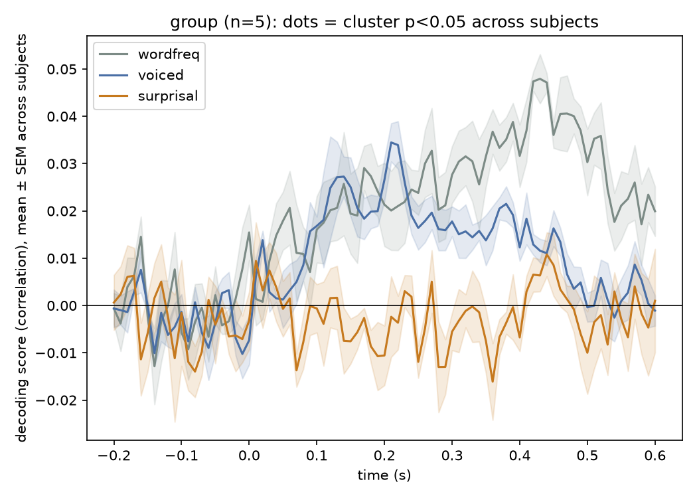
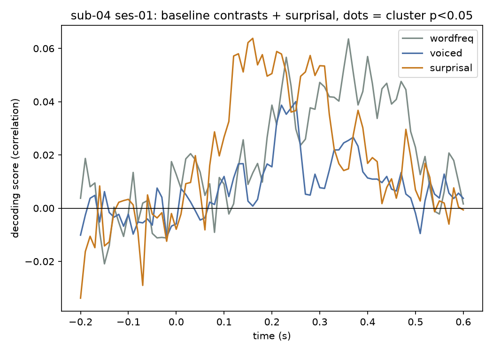

# Decoding Surprisal

Extends [`kingjr/meg-masc`](https://github.com/kingjr/meg-masc) — the MEG-MASC
dataset and decoding code released by Gwilliams, King, et al. — with one new
predictor and the significance testing the released script doesn't do.

Their `check_decoding.py` asks whether MEG activity, time-locked to word and
phoneme onsets, encodes **word frequency** and **phoneme voicing**. This adds
a third question, motivated by their own later paper on predictive coding in
speech comprehension ([Caucheteux, Gramfort & King, 2023, *Nat. Hum.
Behav.*](https://www.nature.com/articles/s41562-022-01516-2)): does it also
encode **word surprisal** — how unpredictable a word is given what came
before, estimated with GPT-2?

## What's original code vs. new

| File | What it is |
|---|---|
| `masc_lib.py` | `segment`, `correlate`, `decod`, `plot` — adapted from their `check_decoding.py` (BSD-3-Clause). `build_metadata` factors out their annotation-parsing so it's reusable; `decod_per_fold` is new. |
| `baseline_decoding.py` | Their two original analyses (word frequency, phoneme voicing), unmodified in substance. |
| `surprisal.py` | New: computes GPT-2 word surprisal from the story transcripts already in the BIDS metadata. |
| `extended_decoding.py` | New: wires surprisal in as a third contrast, then runs a within-subject cluster-based permutation test (folds as observations) — a fast single-subject sanity check. |
| `group_decoding.py` | New: the statistically correct version — `decod_subject` (also new, in `masc_lib.py`) gives one decoding curve per subject, then the cluster test runs across subjects, not folds. |

## Data

5 subjects (`03, 04, 05, 06, 08`) from [MEG-MASC](https://github.com/kingjr/meg-masc)
(OSF project `ag3kj`), not the full 27-subject/~150GB release — enough
subjects for a real group-level test while staying laptop-sized (~17GB).

```
python -m venv .venv && source .venv/bin/activate
pip install -r requirements.txt
python scripts/download_data.py --subject 04 --out data/bids_anonym  # repeat per subject
```

## Run

```
python baseline_decoding.py --subject 04 --sessions 0,1
python surprisal.py --subject 04 --out results/surprisal_sub-04.csv
python extended_decoding.py --subject 04 --sessions 0,1 --surprisal results/surprisal_sub-04.csv
python group_decoding.py --subjects 03,04,05,06,08 --surprisal results/surprisal_sub-04.csv
```

`baseline_decoding.py`/`extended_decoding.py` are single-subject (use
`--sessions 0` for a faster, lower-memory smoke test; `results/*_ses-0.*`
vs `*_ses-01.*` are that comparison). `group_decoding.py` is the main
result — the group-level test across subjects, below.

## Results (group, n=5 subjects)



| contrast | subjects | best cluster p |
|---|---|---|
| word frequency | 5 | 0.06 |
| phoneme voicing | 5 | 0.06 |
| word surprisal | 5 | 0.81 |

This is the statistically correct version of the test: one decoding curve
per *subject* (not per CV fold), then a cluster-based permutation test
across subjects — real independent observations, not pseudo-replications
of one person's data. Word frequency and phoneme voicing both show a
clear, sustained rise from ~100-500ms with the across-subject error band
mostly staying above zero — a consistent effect, not noise. Surprisal
stays flat at zero throughout. Neither effect quite clears p<0.05 (with
only 5 subjects, the minimum possible p-value is 1/32 ≈ 0.03, so this is
one permutation-rank away, not a large gap) — more subjects would very
plausibly push word frequency over the line; see `group_decoding.py`.

## Results (single subject: sub-04, both sessions)



| contrast | trials | best cluster p |
|---|---|---|
| word frequency | 17122 | 0.06 |
| phoneme voicing | 44400 | 0.06 |
| word surprisal | 17106 | 0.06 |

Pooling both of sub-04's listening sessions (vs. just session 0, in
`results/extended_sub-04.png`) sharpens the picture: word frequency
decoding now rises clearly from ~180ms and stays elevated through
400-500ms — close to where the published multi-subject curves peak —
and phoneme voicing shows a similar, smaller rise in the same window.
Surprisal stays flat around zero in *both* the one-session and
two-session runs — a stable null, not just noise on one run.

None of the three contrasts survive cluster correction at p<0.05 in
either run. That's expected, not a bug: with only 5 CV folds as
observations, the permutation test can never report a p-value below
1/32 ≈ 0.03 regardless of how many trials feed each fold — one
subject was never going to reach significance this way. Getting a real
answer on whether surprisal is encoded here would need a group-level
test across subjects, which is exactly the multi-subject design their
own papers use.

## Caveat, stated plainly

5 subjects is still a small group — the permutation test's power ceiling
(min p ≈ 0.03) leaves little room, and both effects that are clearly
visible in the plot fall just short of the conventional p<0.05 line. This
is a demonstration that the method, and the statistics, run correctly
end to end on real data — not a publication-grade significance claim.

## Attribution

`phoneme_info.csv` and the core of `masc_lib.py` are from
[`kingjr/meg-masc`](https://github.com/kingjr/meg-masc), Copyright (c) 2022
Jean-Rémi King, BSD-3-Clause (see `LICENSE`). Data: Gwilliams et al., *MEG-MASC*,
[arXiv:2208.11488](https://arxiv.org/abs/2208.11488).
