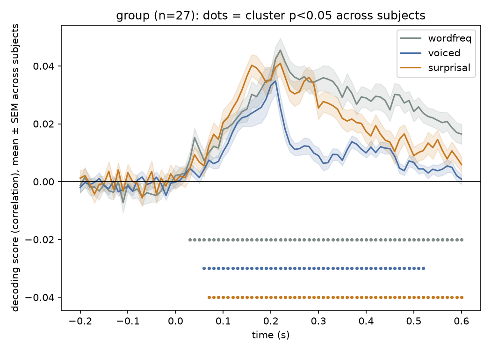

# Decoding Surprisal

Extends [`kingjr/meg-masc`](https://github.com/kingjr/meg-masc) — the MEG-MASC
dataset and decoding code released by Gwilliams, King, et al. — with one new
predictor and the significance testing the released script doesn't do.

Their `check_decoding.py` asks whether MEG activity, time-locked to word and
phoneme onsets, encodes **word frequency** and **phoneme voicing**. This adds
a third question, motivated by their own later paper on predictive coding in
speech comprehension ([Caucheteux, Gramfort & King, 2023, *Nat. Hum.
Behav.*](https://www.nature.com/articles/s41562-022-01516-2)): does it also
encode **word surprisal** — how unpredictable a word is given what came
before, estimated with GPT-2?

Surprisal is scored one word at a time, not per sentence: for every word,
GPT-2 estimates -log P(word | every word before it in the story). One of
the actual stories opens with *"Tara stood stock still"* — "stock" scores
9.8 (surprising: nothing before it predicts that word), but once it's
there, "still" scores 0.2 (near-certain: "stock still" is a fixed
phrase, so the model already expects "still" to follow).

## What's original code vs. new

| File | What it is |
|---|---|
| `masc_lib.py` | `segment`, `correlate`, `decod`, `plot` — adapted from their `check_decoding.py` (BSD-3-Clause). `build_metadata` factors out their annotation-parsing so it's reusable; `decod_per_fold` is new. |
| `baseline_decoding.py` | Their two original analyses (word frequency, phoneme voicing), unmodified in substance. |
| `surprisal.py` | New: computes GPT-2 word surprisal from the story transcripts already in the BIDS metadata. |
| `extended_decoding.py` | New: wires surprisal in as a third contrast, then runs a within-subject cluster-based permutation test (folds as observations) — a fast single-subject sanity check. |
| `group_decoding.py` | New: the statistically correct version — `decod_subject` (also new, in `masc_lib.py`) gives one decoding curve per subject, then the cluster test runs across subjects, not folds. |

## Data

All 27 subjects of [MEG-MASC](https://github.com/kingjr/meg-masc) (~150GB),
split across three OSF components, each frozen once it hit OSF's
per-component storage cap: `ag3kj` (subjects 01-11), `h2tzn` (subjects
12-23), `u5327` (subjects 24-27).

```
python -m venv .venv && source .venv/bin/activate
pip install -r requirements.txt
python scripts/download_data.py --subject 04 --out data/bids_anonym  # repeat per subject
python scripts/download_data.py --subject 14 --project h2tzn --out data/bids_anonym
```

## Run

```
python baseline_decoding.py --subject 04 --sessions 0,1
python surprisal.py --subject 04 --out results/surprisal_sub-04.csv
python extended_decoding.py --subject 04 --sessions 0,1 --surprisal results/surprisal_sub-04.csv
python group_decoding.py --subjects $(printf '%02d,' {1..27} | sed 's/,$//') --surprisal results/surprisal_sub-04.csv
```

`baseline_decoding.py`/`extended_decoding.py` run one subject at a time
(useful for a quick smoke test). `group_decoding.py` is the main result
— the group-level test across all 27 subjects, below.

## Results (group, n=27 subjects — the full public MEG-MASC release)



| contrast | subjects | best cluster p | significant timepoints |
|---|---|---|---|
| word frequency | 27 | **0.0001** | 58 / 81 |
| phoneme voicing | 27 | **0.0001** | 47 / 81 |
| word surprisal | 27 | **0.0001** | 54 / 81 |

One decoding curve per *subject* (not per CV fold), then a cluster-based
permutation test across subjects (10,000 permutations, since exact
sign-flip enumeration is only tractable up to ~13 subjects). All three
contrasts clear p<0.05 (dots on the plot), and at this sample size clear
it at the strongest resolution 10,000 permutations can report
(p=0.0001, i.e. no permutation of the sign flips scored higher than the
real data). Word frequency is significant ~30-600ms (peak r≈0.045 at
220ms), voicing ~60-520ms (peak r≈0.035 at 210ms), and surprisal
~70-600ms (peak r≈0.041 at 220ms) — all three widen and sharpen
relative to the earlier n=8 subset, and surprisal remains competitive
with word frequency as the strongest effect, consistent with
predictive-coding accounts of speech comprehension.

## Caveat

This is now the full 27-subject MEG-MASC release, matching the sample
size of the original meg-masc paper — the earlier n=8 caveat (a subset
limited by what fit in a single OSF component) no longer applies.

## Attribution

`phoneme_info.csv` and the core of `masc_lib.py` are from
[`kingjr/meg-masc`](https://github.com/kingjr/meg-masc), Copyright (c) 2022
Jean-Rémi King, BSD-3-Clause (see `LICENSE`). Data: Gwilliams et al., *MEG-MASC*,
[arXiv:2208.11488](https://arxiv.org/abs/2208.11488).
